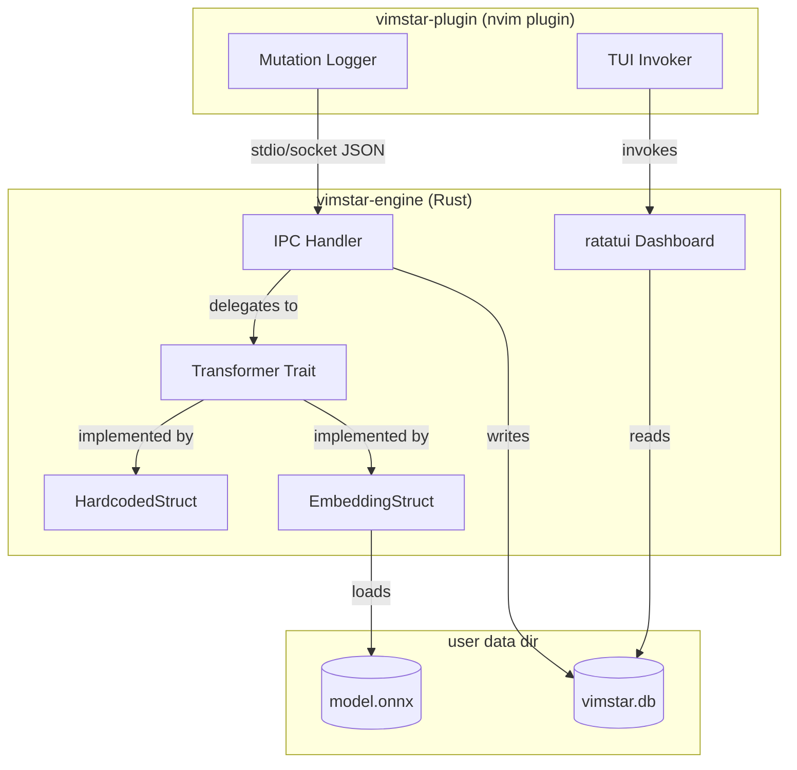

# vimstar\*

A Neovim plugin that surfaces better keystroke sequences as you edit.

## Architecture

```mermaid
flowchart TD
    subgraph plugin["vimstar-plugin (nvim plugin)"]
        m_logger["Mutation Logger"]
        tui_invoker["TUI Invoker"]
    end

    subgraph engine["vimstar-engine (Rust)"]
        ipc_handler["IPC Handler"]

        transformer["Transformer Trait"]
        hardcoded["HardcodedStruct"]
        embedding["EmbeddingStruct"]

        ratatui["ratatui Dashboard"]
    end

    subgraph data["user data dir"]
        sqlite[("vimstar.db")]
        onnx[("model.onnx")]
    end

    m_logger -->|stdio/socket JSON| ipc_handler
    ipc_handler -->|delegates to| transformer
    transformer -->|implemented by| hardcoded
    transformer -->|implemented by| embedding

    embedding -->|loads| onnx

    ipc_handler -->|writes| sqlite

    tui_invoker -->|invokes| ratatui
    ratatui -->|reads| sqlite
```
