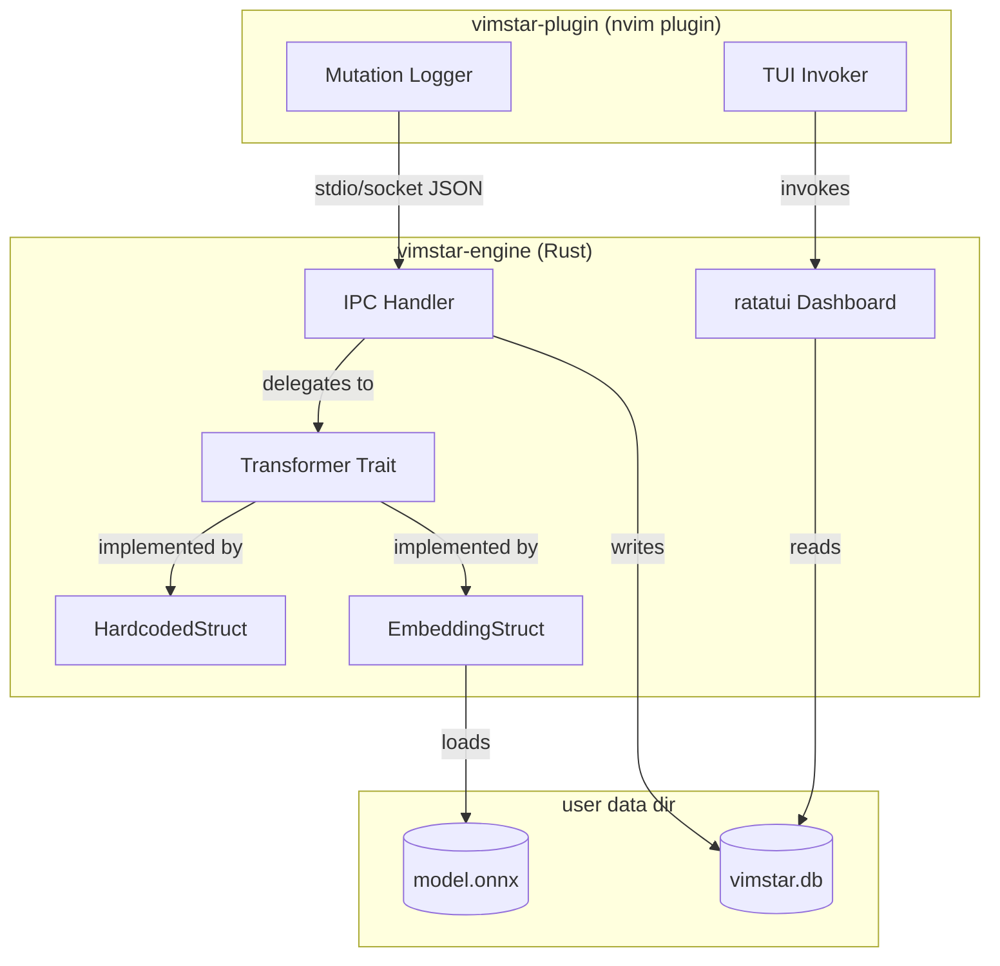
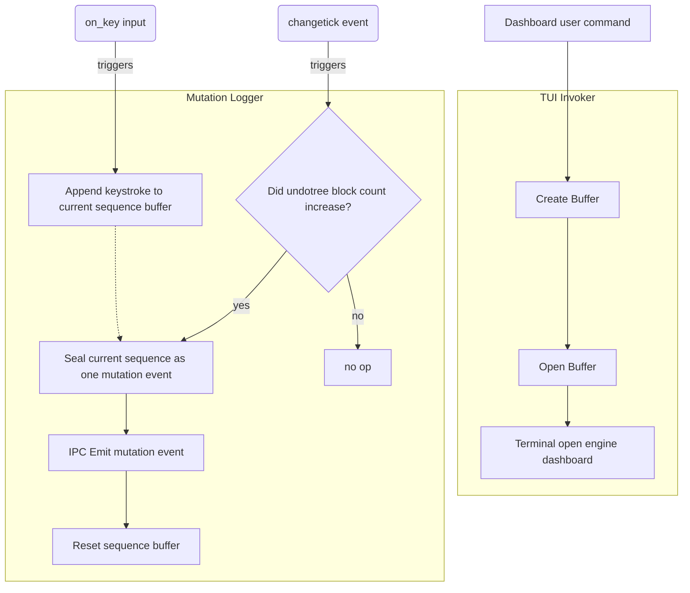

# vimstar\*

A Neovim plugin that surfaces better keystroke sequences as you edit.

## Architecture

### vimstar System Architecture



### `vimstar-plugin` internals



#### IPC Message Format

**mutation** — emitted by the mutation logger on each sealed undo unit
```json
{ "type": "mutation", "keystrokes": [...], "before": [...], "after": [...] }
```
